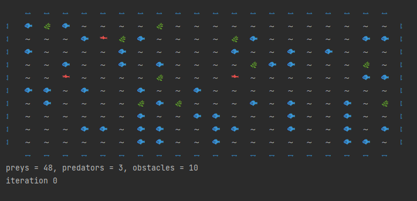
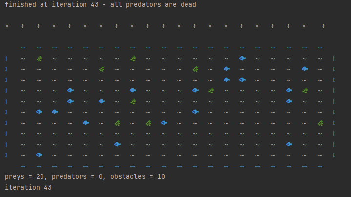
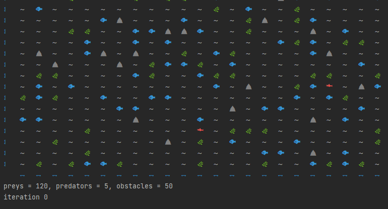
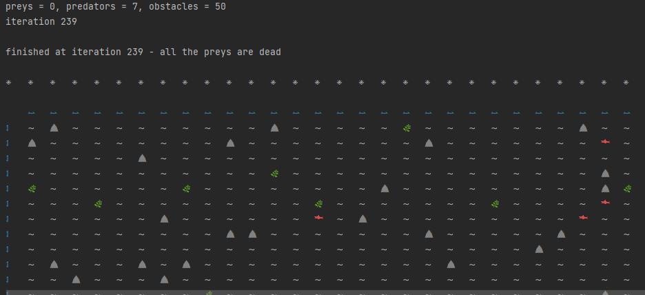

# _Ocean_ `🌊` (Based on the book by R. Weiner and L. Pinson ‘C++ from within’ (1996))

## software system that provides interactive environmental simulation
***
__Preys `🐟`, predators `🦈` , obstacles `⛰` and plankton `🌿` fill the ocean.__

#### Preys (`🐟`) at each iteration random moved across the ocean on one cell or eat nearest plankton.
#### Plankton (`🌿`) can reproduce themself 

#### Predators (`🦈`) eat nearby prey or move

#### All fish have a life cycle (all fish have time to live and time to eat)
#### depending on the settings, the process proceeds differently
#### the process ends when one of the species is extinct, or all iterations have completed
#### number of iterations and setting of input parameters in the module settings.py
***

__process demonstration__ 

__with another settings__

