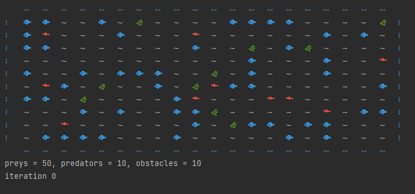
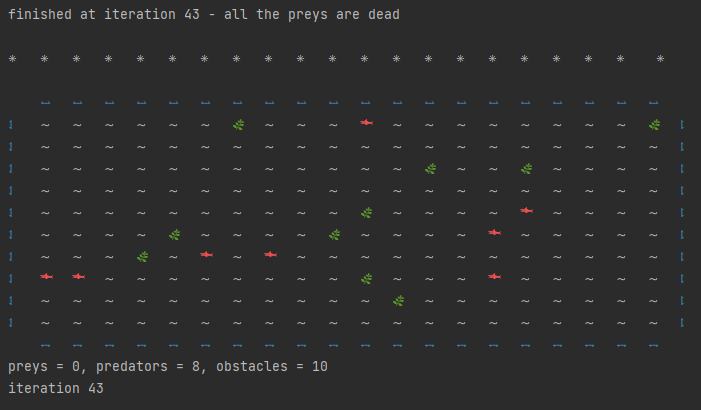

# _Ocean_
software system that provides interactive environmental simulation
***
__Preys, predators, obstacles fill the ocean.__

fishes (at each iteration move to a random nearest cell in ocean)
predators (eat nearby prey or move)
obstacles do nothing 

All fish have a life cycle 
Depending on the settings, the process proceeds differently
The process end when one of the species is dying out, or all iterations have completed

(number of iterations and setting of input parameters in the module settings.py)
***
__process demonstration__ 

__with another settings__

